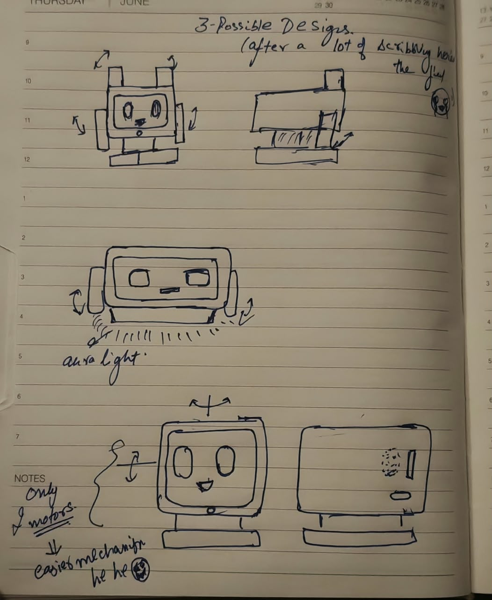
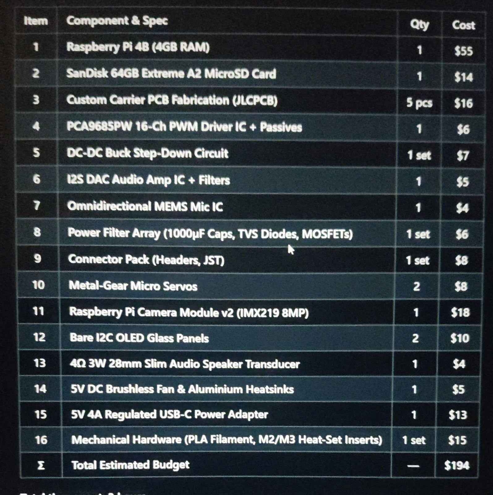

# October 4: Ideation and nailing down the concept

I've been wanting to build a desktop companion for a while as Google Home or Alexa just feel soo lifeless... while I was ~~scrolling~~ searching for ideas on Insta, I stumbled across a reel(ref. in the readme file) and loved the idea, a cute, aesthetic table top pet assistant. 
so, I spent the evening sketching ideas. I initially thought about giving it little arms, but quickly scrapped that, as it overcomplicates the design might takes away from the clean desktop look. 
I settled on the below mentioned core specs:
- A small and cute rounded-cube head with 2 motors to pan and tilt.
- Raspberry Pi camera to handle face tracking.
- An internal cooling fan on the rear so the board stays stable.
Below is an image having my epic designs(sarcastically)

**Total time spent: 3 hours**

# October 5: Rendered some models 
I rendered some models of my hand drawn(💅) sketches using AI(it was pain explaning it to do changes😭 the model isn't perfect yet). Basic port alignments are:
- Front: OLED screen with a cut-out for the camera lens and a pinhole for a microphone.
- Side: Speaker grille, SD card slot and a USB-C breakout port so cables don't snag when the head rotates.
- Back: Mounting space for a fan with head sink.

Ran into a small headache thinking about cable routing through the 2-DOF base, I still haven't figured it out completely.

| Side View | Back View |
| :---: | :---: |
|  |  |

**Total time spent: 3 hours**

# October 6: Building the BOM
Sat down to put together the project documentation and the Bill of Materials. 
I initially considered using breakout modules and proto-boards, but it would create rat's nest of loose wires inside. So, I decided to use a custom PCB with discrete components instead.
Later I did the math and got the whole BOM to land at ~$194.

I didn't take any images of me creating a BOM🥲 so I've added the table
| Item | Component & Spec | Qty | Cost |
| :---: | :--- | :---: | :---: |
| 1 | **Raspberry Pi 4B (4GB RAM)** | 1 | $55 |
| 2 | **SanDisk 64GB Extreme A2 MicroSD Card** | 1 | $14 |
| 3 | **Custom Carrier PCB Fabrication (JLCPCB)** | 5 pcs | $16 |
| 4 | **PCA9685PW 16-Ch PWM Driver IC + Passives** | 1 | $6 |
| 5 | **DC-DC Buck Step-Down Circuit** | 1 set | $7 |
| 6 | **I2S DAC Audio Amp IC + Filters** | 1 | $5 |
| 7 | **Omnidirectional MEMS Mic IC** | 1 | $4 |
| 8 | **Power Filter Array (1000µF Caps, TVS Diodes, MOSFETs)** | 1 set | $6 |
| 9 | **Connector Pack (Headers, JST)** | 1 set | $8 |
| 10 | **Metal-Gear Micro Servos** | 2 | $8 |
| 11 | **Raspberry Pi Camera Module v2 (IMX219 8MP)** | 1 | $18 |
| 12 | **Bare I2C OLED Glass Panels** | 2 | $10 |
| 13 | **4Ω 3W 28mm Slim Audio Speaker Transducer** | 1 | $4 |
| 14 | **5V DC Brushless Fan & Aluminium Heatsinks** | 1 | $5 |
| 15 | **5V 4A Regulated USB-C Power Adapter** | 1 | $13 |
| 16 | **Mechanical Hardware (PLA Filament, M2/M3 Heat-Set Inserts)** | 1 set | $15 |
| **Σ** | **Total Estimated Budget** | — | **$194** |

**Total time spent: 3 hours**
