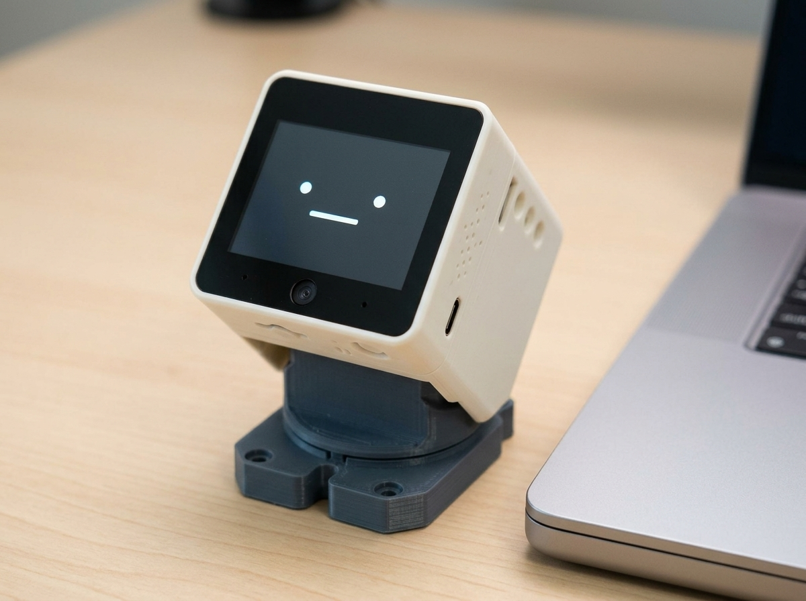
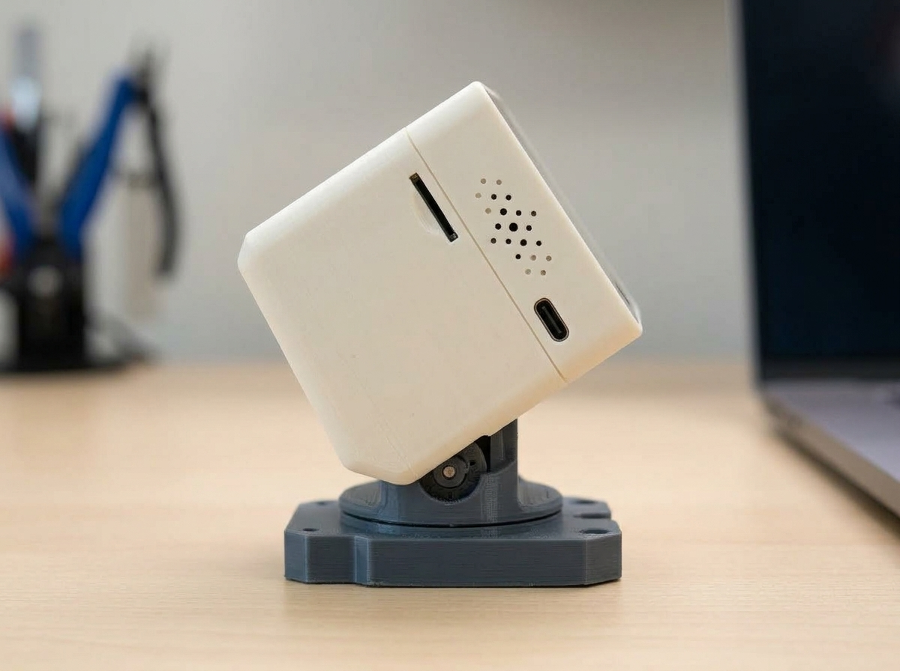
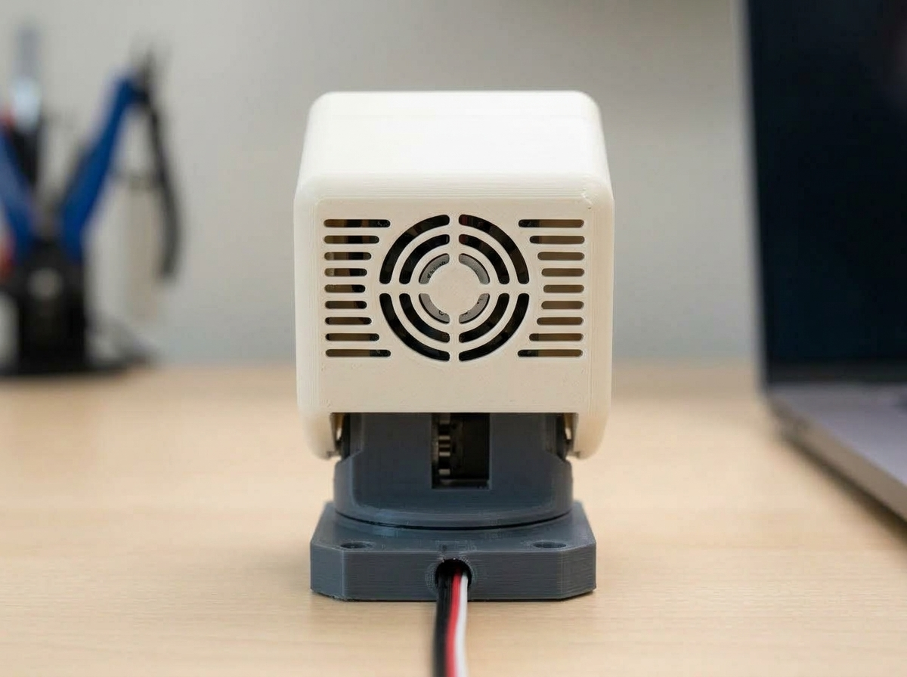

# 🤖 DeskMilo

> **Your expressive desktop AI companion that gives you eye contact, talks back, and helps you lock in.**

  

  
  

---

## 🚀 What's New

### 🛠️ In v0.1 Prototype Release
- [ ] **Initial 2-DOF Rig Assembly:** Built pan-tilt head mechanism for smooth tracking.
- [ ] **Face Tracking V1:** Integrated OpenCV Haar cascade with deadzone smoothing to stop servo jitter.
- [ ] **Active Thermal Circuit:** Added transistor-switched 5V fan to keep the SBC chill during video stream processing.

---

## 📸 Media & Inspiration

> 🎬 **[Watch Inspiration Reel on Instagram](https://www.instagram.com/reel/Dchn35SNEEn/?stkn=cjRoMHJqa2syYXoy)**

| Front View | Side / Pan-Tilt Mechanism |
| :---: | :---: |
|  |  |

---

## ✨ Features

- 👀 **Active 2-DOF Face Tracking:** Uses computer vision to physically pan (left/right) and tilt (up/down) to track your face.
- 🗣️ **Voice & Audio Output:** Integrated speaker allows DeskMilo to greet you, speak task reminders, and play audio feedback.
- ❄️ **Active Thermal Cooling:** Monitored cooling fan ensures the onboard processor stays cool during continuous vision processing.
- 🌐 **Internet-Connected:** Ready to integrate with LLM APIs (OpenAI, Gemini, Ollama) for smart desktop assistance.

---

## 🛒 Bill of Materials (BOM)

| Item | Component | Qty | Approx Cost | Notes / Link |
| :---: | :--- | :---: | :---: | :--- |
## 🛒 Bill of Materials (BOM) — Discrete Circuitry & Fabrication

| Item | Component & Spec | Qty | Cost | Engineering Purpose |
| :---: | :--- | :---: | :---: | :--- |
| 1 | **Raspberry Pi 4B (4GB RAM)** | 1 | $55 | Brain of the system |
| 2 | **SanDisk 64GB Extreme A2 MicroSD Card** | 1 | $14 | Memory of brain |
| 3 | **Custom Carrier PCB Fabrication (JLCPCB)** | 5 pcs | $16 | Nervous system |
| 4 | **PCA9685PW 16-Ch PWM Driver IC + Passives** | 1 | $6 | Motor neurons |
| 5 | **DC-DC Buck Step-Down Circuit** | 1 set | $7 | handle mood swings|
| 6 | **I2S DAC Audio Amp IC + Filters** | 1 | $5 | gives voice to bot...umm...pet |
| 7 | **Omnidirectional MEMS Mic IC** | 1 | $4 | ears |
| 8 | **Power Filter Array (1000µF Caps, TVS Diodes, MOSFETs)** | 1 set | $6 | more neurons... |
| 9 | **Connector Pack (Headers, JST)** | 1 set | $8 | nerve plug points |
| 10 | **Metal-Gear Micro Servos** | 2 | $8 | muscles |
| 11 | **Raspberry Pi Camera Module v2 (IMX219 8MP)** | 1 | $18 | eyes... |
| 12 | **Bare I2C OLED Glass Panels** | 2 | $10 | umm... infographic/additional mouth?? |
| 13 | **4Ω 3W 28mm Slim Audio Speaker Transducer** | 1 | $4 | moreee voice |
| 14 | **5V DC Brushless Fan & Aluminium Heatsinks** | 1 | $5 | keeping the brain icey cool |
| 15 | **5V 4A Regulated USB-C Power Adapter** | 1 | $13 | most important powerrrr |
| 16 | **Mechanical Hardware (PLA Filament, M2/M3 Heat-Set Inserts)** | 1 set | $15 | bodyy  |
| **Σ** | **Total Estimated Budget** | — | **$194** |  |
---

